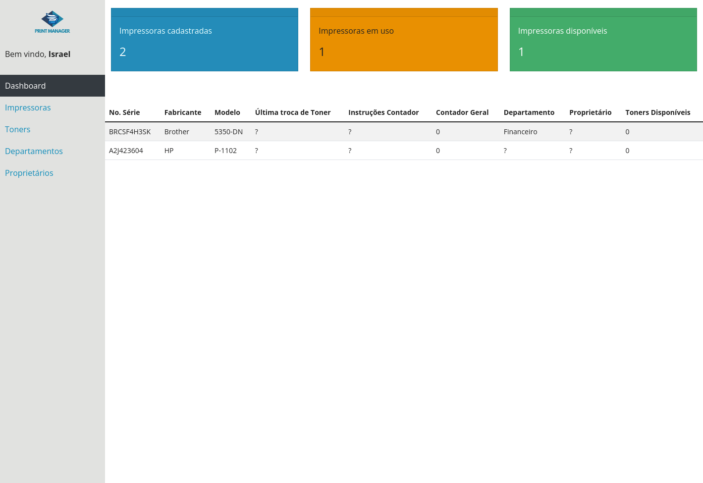

### Como abrir o projeto
1. Aqui mesmo nessa página, vá em `code -> Download ZIP`
2. Após extrair os arquivos, abra o documento `/view/index.html`
3. Caso se depare com um erro de `CORS Policy` instale a extensão [Live Server](https://marketplace.visualstudio.com/items?itemName=ritwickdey.LiveServer) no [Visual Studio Code](https://code.visualstudio.com/download) e clique em "Go Live".
